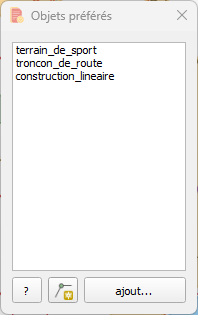
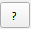
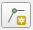

<table>
<colgroup>
<col style="width: 21%" />
<col style="width: 78%" />
</colgroup>
<tbody>
<tr>
<td rowspan="2"></td>
<td style="text-align: center;font-size: 24px;"><strong>Plugin Objets preferés</strong></td>
</tr>
<tr>
<td style="font-size: 16px;text-align: center;">Développeur  : Gérôme PECHEUR (IGN)</td>
</tr>
</tbody>
</table>

**Sommaire**

- [1 Prérequis](#1-prerequis)

- [2 Résumé](#2-resume)

- [3 Présentation](#3-presentation)

- [4 Utilisation](#4-utilisation)

  <h2 id="1-prerequis" style="color: white;margin:0;" >1. Prérequis</h2>

- Version de QGIS : 3.28 ou supérieur

- Le plugin « maitre » doit préalablement être installé : 
[maitre-qgis-plugin sur GitHub](https://github.com/IGNF/maitre-qgis-plugin)

  <h2 id="2-resume" style="color: white;margin:0;" >2. Résumé</h2>

Ce plugin permet d’activer une couche et d’activer la saisie d’une
entité sur cette couche active

  <h2 id="3-presentation" style="color: white;margin:0;" >3. Présentation</h2>

 : Affiche l’historique des
versions et l’aide en ligne.

 : Permet d’activer la saisie
d’une entité sur la couche active

 : permet d’ajouter un layer.

  <h2 id="4-utilisation" style="color: white;margin:0;" >4. Utilisation</h2>

Un clic sur une ligne active automatique le layer correspondant.

Un clic droit sur une ligne permet de supprimer cette ligne.

Une fois qu’un layer est actif, un clic sur
 active la saisie d’une
nouvelle entité.
